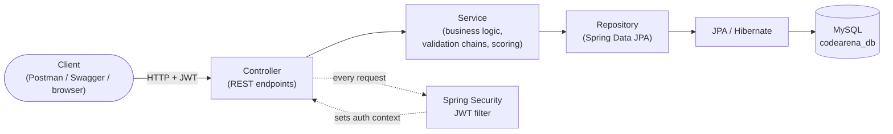

# CodeArena

A backend REST API for a competitive coding-contest platform, built with Spring Boot. Users
register, browse a problem catalog, join time-boxed contests, submit solutions, and see a
live leaderboard with a simple rating system.

This is a portfolio project — the goal was a clean, correctly-layered Spring Boot API with
real authentication, real business rules (contest timing, duplicate-join prevention, scoring),
and a fully documented surface (Swagger + Postman). **v1 does not execute submitted code** —
submissions are persisted as data with a caller-supplied status, and the API scores them
accordingly. See [What I'd do at scale](#what-id-do-at-scale) for what a real judge engine
would add.

## Tech stack

- **Java 21**, **Spring Boot 3.3**, **Maven** (via Maven Wrapper — no local Maven install needed)
- **Spring Web** — REST controllers
- **Spring Data JPA** / Hibernate — persistence
- **Spring Security** — stateless JWT authentication, role-based authorization
- **MySQL** — relational storage
- **springdoc-openapi** — Swagger UI, generated from controller annotations
- **jjwt** — JWT generation/validation
- **JUnit 5 / Mockito / AssertJ** — 38 tests: unit tests for business logic, a
  `@SpringBootTest` + MockMvc integration test for the security filter chain

## Architecture

Standard layered Spring Boot architecture — controllers stay thin (bind, validate, delegate);
all business logic lives in the service layer.



Requests pass through a stateless JWT filter before reaching any controller. Controllers never
see a JPA entity directly in a request or response — every boundary uses a request/response DTO,
and every domain exception (`ResourceNotFoundException`, `DuplicateResourceException`, etc.)
is translated by a single `@RestControllerAdvice` into a consistent
`{"status": <int>, "message": "<string>"}` error shape.

### Package structure (`com.codearena`)

```
controller/   REST endpoints — thin, delegate to services
service/      business logic (scoring, leaderboard, contest state, validation chains)
repository/   Spring Data JPA repositories
entity/       JPA entities — never returned directly from a controller
dto/          request/response DTOs with validation annotations
security/     SecurityConfig, JwtService, JwtAuthenticationFilter, custom entry points
exception/    custom exceptions + the global @RestControllerAdvice handler
config/       OpenAPI/Swagger configuration
```

## Getting started

**Prerequisites:** Java 21, a local MySQL 8 instance running.

```bash
git clone <this-repo-url>
cd CodeArena
```

Create `src/main/resources/application-local.properties` from the committed template (this
file is gitignored — it holds your local DB credentials, never committed):

```bash
cp src/main/resources/application-local.properties.example src/main/resources/application-local.properties
```

Edit it with your MySQL username/password. The database itself (`codearena_db`) is created
automatically on first run (`createDatabaseIfNotExist=true`).

Run the app:

```bash
./mvnw spring-boot:run       # macOS/Linux
.\mvnw.cmd spring-boot:run   # Windows
```

The app boots on `http://localhost:8080`. Confirm it's up:

```bash
curl http://localhost:8080/api/health
# {"status":"UP"}
```

Run the test suite:

```bash
./mvnw test
```

### Explore the API

- **Swagger UI**: `http://localhost:8080/swagger-ui.html` — every endpoint documented and
  callable from the browser. Register/login, then click **Authorize** and paste your token to
  hit protected endpoints.
- **Postman**: import [`codearena.postman_collection.json`](codearena.postman_collection.json)
  — 38 requests covering the full test matrix below (auth, admin CRUD, contest lifecycle,
  submissions, leaderboard). One manual step is required and documented in the collection: this
  API has no admin-creation endpoint, so promote the registered admin user directly in MySQL
  (`UPDATE users SET role='ADMIN' WHERE email=...`) before running the admin-only requests.

## API reference

All endpoints are under `/api`. Endpoints marked **admin** require `ROLE_ADMIN`; everything
else marked **auth** just needs any valid JWT. `/api/auth/**` and `/api/health` are public.

### Authentication
| Method | Endpoint | Access | Description |
|---|---|---|---|
| POST | `/api/auth/register` | public | Register a new user (role `USER`) |
| POST | `/api/auth/login` | public | Log in by email, receive a JWT |

### Problems
| Method | Endpoint | Access | Description |
|---|---|---|---|
| POST | `/api/problems` | admin | Create a problem |
| GET | `/api/problems` | auth | Search — optional `?difficulty=&topic=&page=&size=` |
| GET | `/api/problems/{id}` | auth | Get a problem by id |
| PUT | `/api/problems/{id}` | admin | Replace a problem |
| DELETE | `/api/problems/{id}` | admin | Delete a problem |

### Contests
| Method | Endpoint | Access | Description |
|---|---|---|---|
| POST | `/api/contests` | admin | Create a contest (`end_time` must be after `start_time`) |
| GET | `/api/contests` | auth | List all contests |
| GET | `/api/contests/{id}` | auth | Get a contest by id |
| POST | `/api/contests/{contestId}/problems/{problemId}` | admin | Associate a problem with a contest |
| GET | `/api/contests/{id}/status` | auth | Live `UPCOMING`/`ACTIVE`/`ENDED` status + seconds remaining |
| POST | `/api/contests/{id}/join` | auth | Join a contest (allowed until it ends) |

### Submissions
| Method | Endpoint | Access | Description |
|---|---|---|---|
| POST | `/api/submissions` | auth | Submit a solution (validated, then scored) |
| GET | `/api/submissions/my` | auth | The caller's own submissions |

### Leaderboard
| Method | Endpoint | Access | Description |
|---|---|---|---|
| GET | `/api/contests/{id}/leaderboard` | auth | Ranked participants by summed accepted score |

### Users
| Method | Endpoint | Access | Description |
|---|---|---|---|
| GET | `/api/users/me` | auth | Own profile — username, rating, problems solved, contests joined |

## Business rules worth knowing about

- **Contest state is never client-supplied.** `UPCOMING`/`ACTIVE`/`ENDED` is computed
  server-side from `start_time`/`end_time` vs. the server clock on every request.
- **Submission validation is a strict chain**: contest exists → problem exists → caller has
  joined the contest → contest is `ACTIVE` → problem is actually associated with that contest.
  Any failure returns a specific error, never a silent no-op.
- **Scoring** lives in a dedicated `ScoreService`: `ACCEPTED` scores 100/200/300 by
  difficulty (EASY/MEDIUM/HARD), everything else scores 0.
- **Rating** (+10 for participating, +50 more for finishing top 3) is applied once a contest
  ends, the first time its leaderboard is viewed — guarded by a flag so repeated views can't
  double-credit it.
- **No user enumeration**: a login with a wrong password and a login with a nonexistent email
  return the identical 401 message.

## What I'd do at scale

Deliberately out of scope for v1, called out here to show where the boundary was drawn on
purpose rather than by oversight:

- **A real code-execution engine.** Submissions currently persist a caller-supplied
  status/score instead of compiling and running code. A production judge would need sandboxed
  execution (e.g., Docker-per-submission or a service like Judge0), a queue to decouple
  submission from grading, and per-language resource/time limits.
- **Redis caching.** Leaderboards and contest status are recomputed from the database on every
  request. For a contest with heavy concurrent traffic, that's the first thing I'd cache —
  short-TTL leaderboard snapshots, invalidated on new ACCEPTED submissions.
- **A React frontend.** This is a backend-only API by design — a real product needs a UI on
  top of this contract. The planned build-out is already scoped in
  [`CodeArena_Frontend_Build_Guide.md`](CodeArena_Frontend_Build_Guide.md): a 14-phase
  React + TypeScript + Vite roadmap (auth pages, protected routing, problem/contest/
  leaderboard views, admin CRUD screens, deployment), started once this API was complete.
- Other things I'd add before calling this production-ready: rate limiting on auth endpoints,
  refresh tokens (current JWTs are 24h with no revocation), pagination on `GET /api/contests`
  and `GET /api/submissions/my` (currently unpaginated lists), and structured audit logging
  around admin actions.

## Highlights

- Designed and built a 20+ endpoint REST API for a coding-contest platform using Spring Boot,
  MySQL, and JWT-based authentication with role-based access control.
- Implemented server-side contest state management, duplicate-participation prevention, and a
  scoring/leaderboard engine backed by a layered Controller-Service-Repository architecture.
- Documented and tested the full API surface with Swagger/OpenAPI and a Postman regression
  suite covering auth, CRUD, and business-rule edge cases.
